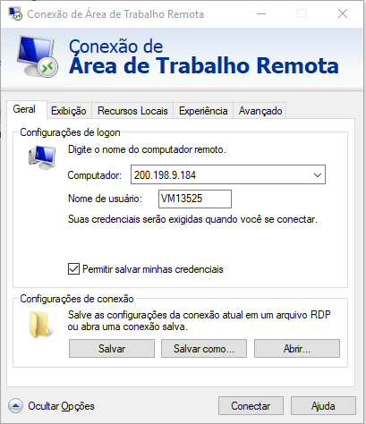

- Context
- What
    - Acceptance criteria
- Why
- How
- Open questions
- Examples/Research
    - Low-fidelity mockup
    - Other examples

## Context

[Link para outra nota](/20230324T170445)

Apesar de serem ambas iniciativas da Open Knowledge, o CKAN não possui suporte nativo para a importação de pacotes de dados. Atualmente a CGE tem feito a importação por meio de uma ferramenta CLI desenvolvida internamente, o [dpckan](https://github.com/transparencia-mg/dpckan). O `dpckan` atualmente faz o mapeamento de algumas propriedades entre _frictionless_ e CKAN, mas ainda armazena o arquivo `datapackage.json` como um recurso adicional no conjunto de dados do CKAN.

Apesar da importância de um fluxo de importação programático que permita a automatização das publicações e atualizações, as oficinas piloto com os órgãos e entidades tem demonstrado a importância de um fluxo de importação manual via interface gráfica para usuários iniciantes e/ou não técnicos[^1].

## Open questions

- Como o pacote de dados e seu conteúdo devem ser armazenados no CKAN?

- É possível uma conversão ida-e-volta sem perda de metadados (_lossless_) entre um pacote de dados frictionless e um conjunto de dados CKAN?

- Como permitir que alterações nos metadados sejam realizadas pela interface gráfica e/ou interface de linha de comando? Vide [dpckan#153](https://github.com/transparencia-mg/dpckan/issues/153)

## Examples/Research

- [Replicação e sincronização de um data package com CKAN](https://discuss.okfn.org/t/replicacao-e-sincronizacao-de-um-data-package-com-ckan/9830) - Discussão sobre o fluxo de importação de pacotes de dados armazenados em um repositório git com indicação de ferramentas possivelmente úteis oferecidas por um ex-desenvolvedor da Open Knowledge. Ele relatou que a extensão [ckanext-datapackager](https://github.com/frictionlessdata/ckanext-datapackager) é próxima do que precisamos, mas não permite sobrescrever um conjunto de dados já existente.

- Frictionless CKAN Mapper - Bibliotecas em [Python](https://github.com/frictionlessdata/frictionless-ckan-mapper) e [Javascript](https://github.com/datopian/frictionless-ckan-mapper-js) para conversão de pacotes de dados _frictionless_ e conjuntos de dados CKAN. 

- [CKAN Client Guide](https://tech.datopian.com/ckan-client-guide/) - Guia da [Datopian](https://www.datopian.com/) sobre as bibliotecas [ckan-client-py](https://github.com/datopian/ckan-client-py) e [ckan-client-js](https://github.com/datopian/ckan-client-js) para interação programática com uma instância do CKAN

- Support for Simple Data Format Data Packages [#778](https://github.com/OpenRefine/OpenRefine/issues/778) - Discussão sobre importação e exportação de pacotes de dados usando [Open Refine](https://openrefine.org/)

- Advance CKAN plugin to the stable state [#475](https://github.com/frictionlessdata/frictionless-py/issues/475)

- [CKAN - Data Curator Integration](https://github.com/ODIQueensland/ckan-data-curator-integration)

[^1]: No [blog](https://tech.datopian.com/publish/#introduction) da Datopian existe uma discussão sobre os fluxos alternativos para publicação de conjuntos de dados. Uma discussão mais ampla sobre os trade-offs entre interfaces GUI e CLIs pode ser encontrada [aqui](http://www.catb.org/esr/writings/taoup/html/ch11s04.html).